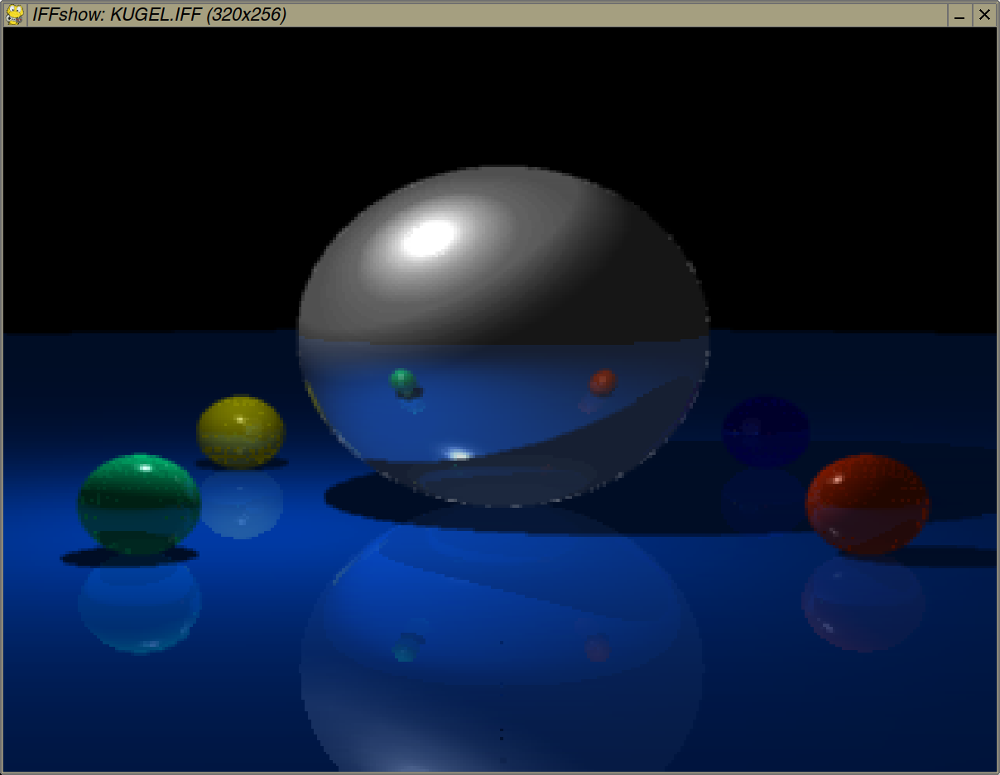

## IFFshow, an IFF-ILBM image viewer in Python

(Requires PyGame)

    iffshow.py filename

Loads the picture given as a commandline argument and displays it in a PyGame window.

Press Space to toggle showing the image palette. Press Escape or close the window to quit.

Images are always resized to the size of the IFFshow window (1200x900px by default).

The common Amiga graphics modes including EHB, HAM6, HAM8, and 24-/32-bit deep color should all work. There is also support for 8-bit IFF-PBM images.

### IFF-ILBM creation scripts

(Both require PyGame)

#### 24-bit

    iff24.py filename

Converts an input image to an uncompressed 24-bit IFF-ILBM file.

The input should be a JPG or PNG file and preferably in an aspect ratio close to 4:3.

By default the output image is in low-res PAL resolution (320x256px).

DeluxePaint V on the Amiga can read these 24-bit IFF images and convert them e.g. to HAM8 or 256 colors if you disable the DPaint backing store.

#### HAM

    ham.py filename

Similar to iff24.py, but it converts an input image to an uncompressed 6-bit HAM mode IFF-ILBM file. No palette is used, therefore image quality is not the greatest.

    ham8.py filename

Same as ham.py, but for 8-bit HAM mode. Parts of the image with subtle color gradients like the sky will look a bit better in HAM8 than in HAM6.

### License

Public Domain / CC0

### Screenshot

