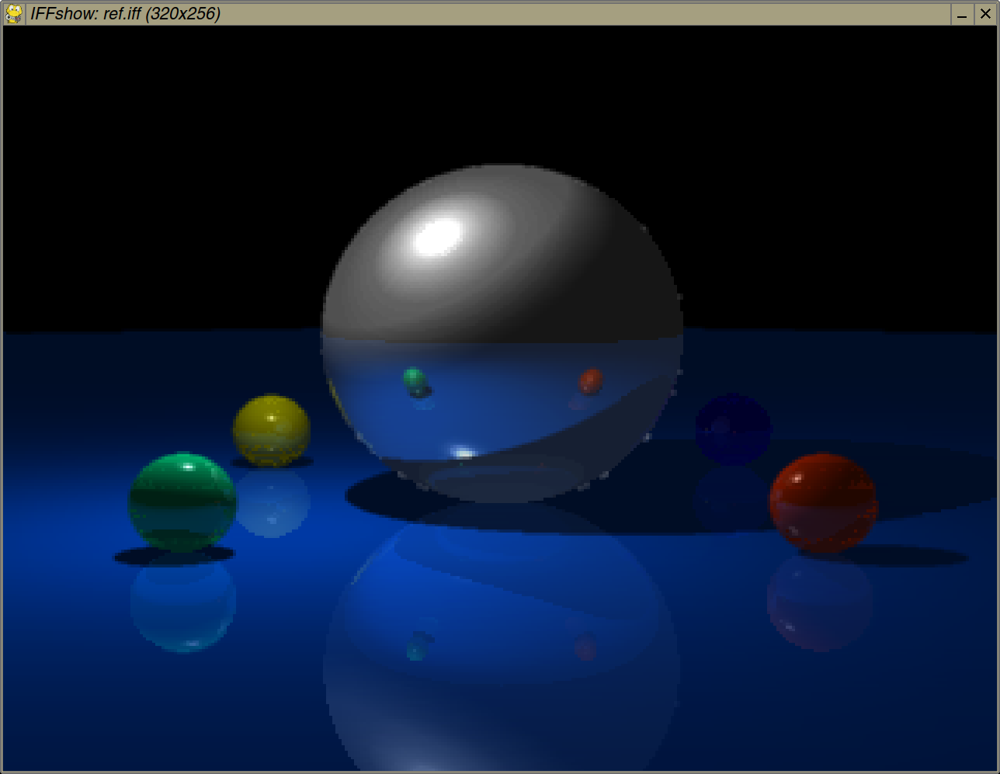

## IFFshow, an IFF-ILBM image viewer in Python

Requires PyGame

    iffshow.py filename [pal]

Loads the picture given as a commandline argument and displays it in a PyGame window.

Press Escape or close window to quit.

Images are always resized to the size of the window (1200x900px by default).

The common Amiga graphics modes including EHB, HAM6, HAM8, and 24-/32-bit deep color should all work. Adding "pal" as a second argument will show the image palette instead.

Standalone IFF palette files are also supported and do not require the "pal" argument.

### License

Public Domain / CC0

### Screenshot

